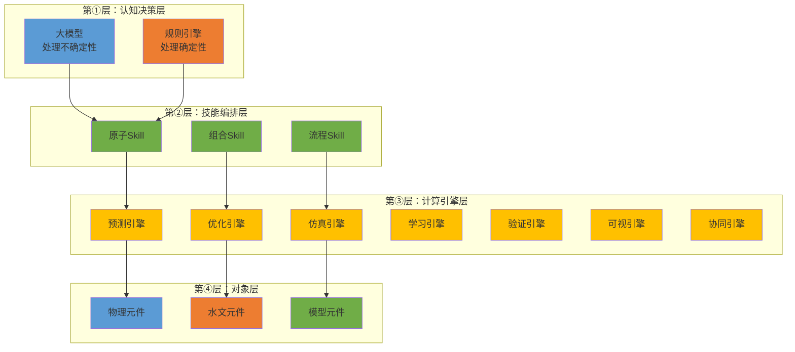
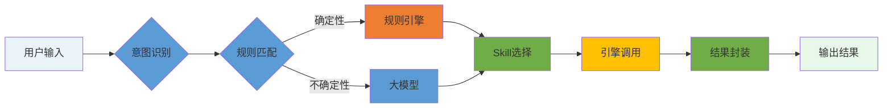
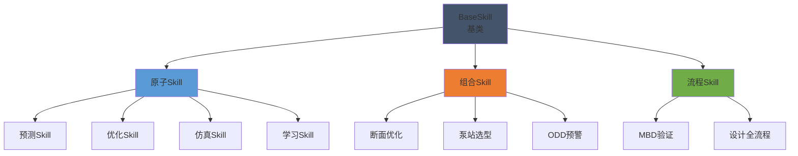
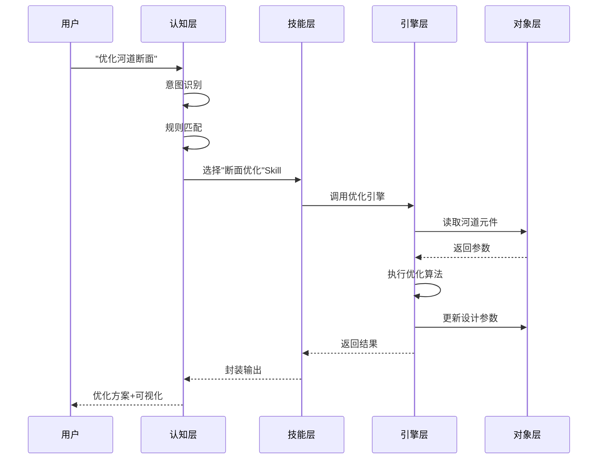
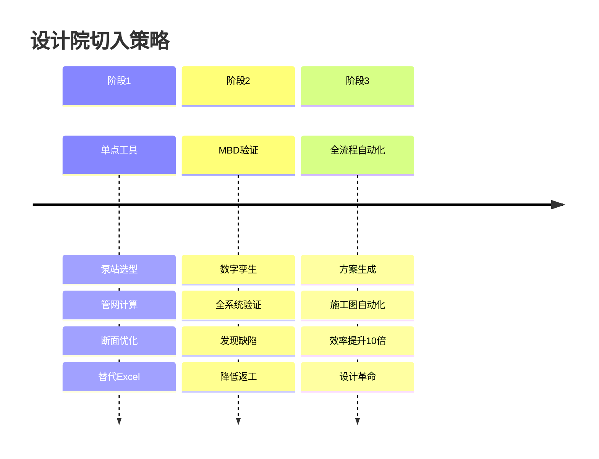
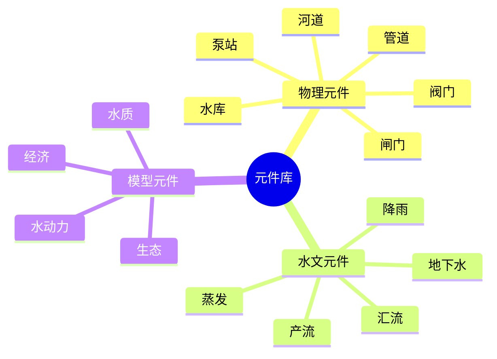
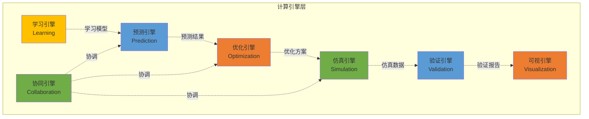
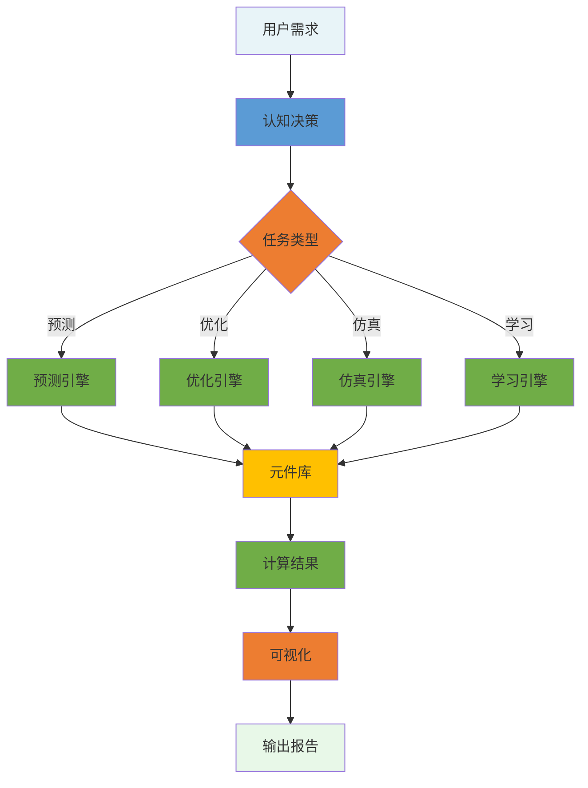

# HydroClaw PPT 配图 - Mermaid图表

## 1. 四层架构图

```mermaid
graph TB
    subgraph "第①层：认知决策层"
        A1[大模型<br/>处理不确定性]
        A2[规则引擎<br/>处理确定性]
    end

    subgraph "第②层：技能编排层"
        B1[原子Skill]
        B2[组合Skill]
        B3[流程Skill]
    end

    subgraph "第③层：计算引擎层"
        C1[预测引擎]
        C2[优化引擎]
        C3[仿真引擎]
        C4[学习引擎]
        C5[验证引擎]
        C6[可视引擎]
        C7[协同引擎]
    end

    subgraph "第④层：对象层"
        D1[物理元件]
        D2[水文元件]
        D3[模型元件]
    end

    A1 --> B1
    A2 --> B1
    B1 --> C1
    B2 --> C2
    B3 --> C3
    C1 --> D1
    C2 --> D2
    C3 --> D3

    style A1 fill:#5B9BD5
    style A2 fill:#ED7D31
    style B1 fill:#70AD47
    style B2 fill:#70AD47
    style B3 fill:#70AD47
    style C1 fill:#FFC000
    style C2 fill:#FFC000
    style C3 fill:#FFC000
    style C4 fill:#FFC000
    style C5 fill:#FFC000
    style C6 fill:#FFC000
    style C7 fill:#FFC000
    style D1 fill:#5B9BD5
    style D2 fill:#ED7D31
    style D3 fill:#70AD47
```

## 2. 认知决策流程图

```mermaid
flowchart LR
    A[用户输入] --> B{意图识别}
    B --> C{规则匹配}
    C -->|确定性| D[规则引擎]
    C -->|不确定性| E[大模型]
    D --> F[Skill选择]
    E --> F
    F --> G[引擎调用]
    G --> H[结果封装]
    H --> I[输出结果]

    style A fill:#E8F4F8
    style B fill:#5B9BD5
    style C fill:#5B9BD5
    style D fill:#ED7D31
    style E fill:#5B9BD5
    style F fill:#70AD47
    style G fill:#FFC000
    style H fill:#70AD47
    style I fill:#E8F8E8
```

## 3. Skill三层继承

```mermaid
graph TD
    A[BaseSkill<br/>基类] --> B[原子Skill]
    A --> C[组合Skill]
    A --> D[流程Skill]

    B --> B1[预测Skill]
    B --> B2[优化Skill]
    B --> B3[仿真Skill]
    B --> B4[学习Skill]

    C --> C1[断面优化]
    C --> C2[泵站选型]
    C --> C3[ODD预警]

    D --> D1[MBD验证]
    D --> D2[设计全流程]

    style A fill:#44546A
    style B fill:#5B9BD5
    style C fill:#ED7D31
    style D fill:#70AD47
```

## 4. 运行示例序列图

```mermaid
sequenceDiagram
    participant U as 用户
    participant C as 认知层
    participant S as 技能层
    participant E as 引擎层
    participant O as 对象层

    U->>C: "优化河道断面"
    C->>C: 意图识别
    C->>C: 规则匹配
    C->>S: 选择"断面优化"Skill
    S->>E: 调用优化引擎
    E->>O: 读取河道元件
    O-->>E: 返回参数
    E->>E: 执行优化算法
    E->>O: 更新设计参数
    E-->>S: 返回结果
    S-->>C: 封装输出
    C-->>U: 优化方案+可视化
```

## 5. 设计院三阶段渗透

```mermaid
timeline
    title 设计院切入策略
    section 阶段1
        单点工具 : 泵站选型
                 : 管网计算
                 : 断面优化
                 : 替代Excel
    section 阶段2
        MBD验证 : 数字孪生
                : 全系统验证
                : 发现缺陷
                : 降低返工
    section 阶段3
        全流程自动化 : 方案生成
                    : 施工图自动化
                    : 效率提升10倍
                    : 设计革命
```

## 6. 元件库结构

```mermaid
mindmap
  root((元件库))
    物理元件
      水库
      河道
      闸门
      泵站
      管道
      阀门
    水文元件
      降雨
      蒸发
      产流
      汇流
      地下水
    模型元件
      水动力
      水质
      生态
      经济
```

## 7. 七大引擎关系图

```mermaid
graph TB
    subgraph "计算引擎层"
        E1[预测引擎<br/>Prediction]
        E2[优化引擎<br/>Optimization]
        E3[仿真引擎<br/>Simulation]
        E4[学习引擎<br/>Learning]
        E5[验证引擎<br/>Validation]
        E6[可视引擎<br/>Visualization]
        E7[协同引擎<br/>Collaboration]
    end

    E1 -.->|预测结果| E2
    E2 -.->|优化方案| E3
    E3 -.->|仿真数据| E5
    E4 -.->|学习模型| E1
    E5 -.->|验证报告| E6
    E7 -.->|协调| E1
    E7 -.->|协调| E2
    E7 -.->|协调| E3

    style E1 fill:#5B9BD5
    style E2 fill:#ED7D31
    style E3 fill:#70AD47
    style E4 fill:#FFC000
    style E5 fill:#5B9BD5
    style E6 fill:#ED7D31
    style E7 fill:#70AD47
```

## 8. 数据流图

```mermaid
flowchart TD
    A[用户需求] --> B[认知决策]
    B --> C{任务类型}

    C -->|预测| D1[预测引擎]
    C -->|优化| D2[优化引擎]
    C -->|仿真| D3[仿真引擎]
    C -->|学习| D4[学习引擎]

    D1 --> E[元件库]
    D2 --> E
    D3 --> E
    D4 --> E

    E --> F[计算结果]
    F --> G[可视化]
    G --> H[输出报告]

    style A fill:#E8F4F8
    style B fill:#5B9BD5
    style C fill:#ED7D31
    style D1 fill:#70AD47
    style D2 fill:#70AD47
    style D3 fill:#70AD47
    style D4 fill:#70AD47
    style E fill:#FFC000
    style F fill:#70AD47
    style G fill:#ED7D31
    style H fill:#E8F8E8
```
